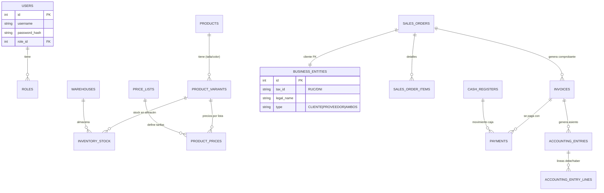

# Modelo de Datos - Sistema Comercial (Retail/Mayorista)

Este documento define el esquema de base de datos para **PostgreSQL**. Se utiliza una convención de nombres en inglés (`snake_case` o `PascalCase` según preferencia, aquí usaremos `snake_case` para DB por convención Postgres) para facilitar la internacionalización y estándares, aunque los comentarios estarán en español.

## 1. Diagrama Entidad-Relación (Alto Nivel)



## 2. Definición Detallada de Tablas

### A. Módulo de Inventario (`inventory`)

| Tabla                    | Descripción                                            | Columnas Clave                                                                   |
| :----------------------- | :----------------------------------------------------- | :------------------------------------------------------------------------------- |
| `products`               | Definición genérica del producto (Camisa Polo).        | `id`, `name`, `brand_id`, `category_id`, `unit_measure`, `is_active`             |
| `product_variants`       | Variantes específicas (Camisa Polo - Rojo - M).        | `id`, `product_id`, `sku`, `barcode`, `size`, `color`, `cost_price`              |
| `warehouses`             | Almacenes físicos o lógicos.                           | `id`, `name`, `address`, `is_main`                                               |
| `inventory_stock`        | Stock actual por variante y almacén.                   | `id`, `variant_id`, `warehouse_id`, `quantity_on_hand`, `quantity_reserved`      |
| `inventory_transactions` | Kardex físico (historial).                             | `id`, `variant_id`, `warehouse_id`, `type (IN/OUT)`, `quantity`, `reference_doc` |
| `price_lists`            | Listas de precios (Retail, Mayorista A, Distribuidor). | `id`, `name`, `currency`, `is_tax_included`                                      |
| `product_prices`         | Precio por variante y lista.                           | `id`, `price_list_id`, `variant_id`, `price`                                     |

### B. Módulo de Ventas (`sales`)

| Tabla               | Descripción                            | Columnas Clave                                                                  |
| :------------------ | :------------------------------------- | :------------------------------------------------------------------------------ |
| `sales_orders`      | Pedido de venta o Cotización.          | `id`, `customer_id`, `status (DRAFT/CONFIRMED)`, `total_amount`, `currency`     |
| `sales_order_items` | Detalle del pedido.                    | `id`, `order_id`, `variant_id`, `quantity`, `unit_price`, `discount`, `total`   |
| `invoices`          | Documento tributario (Factura/Boleta). | `id`, `order_id`, `serie`, `number`, `tax_id_customer`, `xml_status`, `pdf_url` |

### C. Módulo Contable (`accounting`)

| Tabla                    | Descripción                      | Columnas Clave                                                                    |
| :----------------------- | :------------------------------- | :-------------------------------------------------------------------------------- |
| `chart_of_accounts`      | Plan de Cuentas Contable.        | `id`, `code (10.1.1)`, `name`, `type (ASSET/LIABILITY/EQUITY/INCOME/EXPENSE)`     |
| `accounting_entries`     | Asientos Contables (Cabecera).   | `id`, `date`, `description`, `reference_module (SALES/PURCHASES)`, `reference_id` |
| `accounting_entry_lines` | Líneas del asiento (Debe/Haber). | `id`, `entry_id`, `account_id`, `debit`, `credit`                                 |

## 3. Scripts SQL Iniciales (Core)

```sql
-- Ejemplo de creación de la tabla central de PRODUCTOS
CREATE TABLE products (
    id SERIAL PRIMARY KEY,
    name VARCHAR(255) NOT NULL,
    description TEXT,
    brand_id INT, -- FK
    category_id INT, -- FK
    created_at TIMESTAMP DEFAULT CURRENT_TIMESTAMP
);

-- Ejemplo VARIANTES (SKU)
CREATE TABLE product_variants (
    id SERIAL PRIMARY KEY,
    product_id INT NOT NULL REFERENCES products(id),
    sku VARCHAR(50) UNIQUE NOT NULL,
    barcode VARCHAR(50),
    attribute_json JSONB, -- Para guardar { "color": "red", "size": "M" } flexiblemente
    cost_price DECIMAL(18, 4) DEFAULT 0
);

-- Ejemplo PRECIOS
CREATE TABLE product_prices (
    id SERIAL PRIMARY KEY,
    variant_id INT NOT NULL REFERENCES product_variants(id),
    price_list_id INT NOT NULL, -- FK
    price DECIMAL(18, 2) NOT NULL,
    min_quantity INT DEFAULT 1 -- Para precios por volumen (escalado mayorista)
);
```

### Consideraciones de Diseño para Mayorista vs Retail

1.  **Precios por Volumen:** En la tabla `product_prices` agregamos `min_quantity`. Esto permite que el sistema detecte automáticamente:
    - 1 unidad: S/ 10.00
    - 12 unidades: S/ 8.50
2.  **Unidades de Medida:** `products` debe manejar unidad base (ej. Unidad) y conversiones (ej. Caja de 12).
3.  **Límite de Crédito:** La tabla `business_entities` debe tener `credit_limit` y `payment_days` para bloquear ventas a crédito si el cliente mayorista debe mucho.
