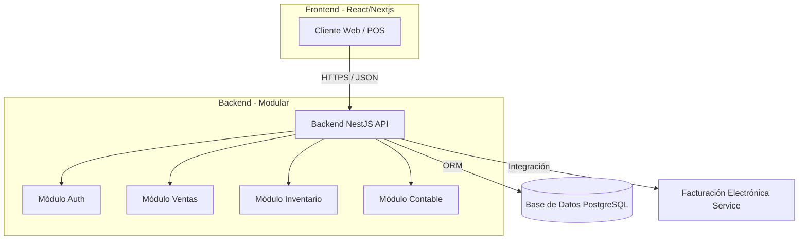

# Propuesta de Arquitectura para Sistema Comercial (Retail y Mayorista)

Esta propuesta detalla los módulos necesarios para un sistema comercial escalable, comenzando con operaciones de Retail y Venta Mayorista, con proyección a integración contable.

## 1. Módulos Esenciales (MVP - Mínimo Producto Viable)

Para comercializar a distintos comercios (Multitenant o Instalable), el sistema debe ser sólido en la gestión de inventario y flexible en precios.

### A. Módulo de Inventario y Catálogo (El Corazón)

- **Gestión de Productos:** Soporte para variantes (Talla, Color), Códigos de Barras, SKU, Categorías y Marcas.
- **Multi-Precios:** Listas de precios configurables (Precio Público, Precio Mayorista, Precio Distribuidor).
- **Control de Stock:** Entradas, Salidas, Ajustes y Transferencias entre almacenes (crucial si creces a sucursales).
- **Kardex Valorizado:** Historial de movimientos y costo promedio/último costo.

### B. Módulo de Ventas y Facturación

Este módulo debe comportarse diferente según el canal:

- **Modo Retail (POS - Punto de Venta):** Interfaz rápida (Touch o Teclado), lector de códigos, apertura/cierre de caja, emisión rápida de tickets/boletas.
- **Modo Mayorista:** Gestión de Cotizaciones, Ordenes de Venta, Gestión de Créditos, Descuentos por volumen.
- **Facturación Electrónica:** Generación de XML/PDF conforme a la normativa local (SUNAT u otro ente).

### C. Módulo de Clientes (CRM Básico)

- Registro de clientes.
- Historial de compras.
- **Línea de Crédito:** Límite de crédito y días de pago para clientes mayoristas.

### D. Módulo de Compras y Proveedores

- Gestión de proveedores.
- Registro de facturas de compra (abastecimiento).
- Cuentas por pagar.

### E. Módulo de Seguridad y Usuarios

- Roles y Permisos (Cajero, Vendedor, Supervisor, Administrador, Contador).
- Auditoría de acciones sensibles (anulaciones, cambios de precio).

---

## 2. El "Siguiente Nivel" y Módulo Contable

Para llevarlo al siguiente nivel, la integración contable es un gran diferenciador.

### Módulo de Declaración Contable / Finanzas

Sí, se puede y debe incluir. Recomendamos tres sub-niveles de implementación:

1.  **Nivel Básico (Operativo):** Libro Diario simplificado base caja (Ingresos vs Egresos), Reporte de Ventas y Compras para declaración de impuestos mensual.
2.  **Nivel Intermedio (Financiero):** Flujo de Caja (Cashflow), Cuentas por Cobrar/Pagar centralizadas, Conciliación Bancaria básica.
3.  **Nivel Avanzado (Integración Contable):** Generación de "Asientos Contables" automáticos por cada operación (Venta genera asiento de costo de venta, salida de mercadería, cuenta por cobrar, e IGV/IVA). Exportación a formatos PLAME/PLE (o equivalentes locales).

**Recomendación:** Para el MVP, implementa el **Nivel Básico** (Reportes de Ventas/Compras exportables a Excel/TXT para contadores). No intentes reemplazar un software contable completo al inicio, enfócate en facilitar la "Pre-contabilidad".

---

## 3. Recomendación Tecnológica (Tech Stack)

Para un sistema moderno, escalable y mantenible en 2026, recomiendo la siguiente arquitectura basada en JavaScript/TypeScript (un solo lenguaje para todo el equipo):

### Frontend (Lo que ve el usuario)

- **Tecnología:** **React** (vía **Next.js** o **Vite**).
- **Por qué:** Es el estándar de la industria. Permite crear interfaces muy rápidas e interactivas (necesario para el POS).
- **Estilos:** **Tailwind CSS** + **Shadcn/UI** (Componentes profesionales, limpios y personalizables).
- **Gestión de Estado:** **TanStack Query** (React Query) para manejo eficiente de datos del servidor y **Zustand** para estado global (carrito de compras, sesión).

### Backend (La lógica del negocio)

- **Tecnología:** **NestJS** (Node.js).
- **Por qué:** Utiliza TypeScript nativo. Su arquitectura modular (Controllers, Services, Modules) facilita enormemente escalar el sistema (puedes tener un `SalesModule`, `AccountingModule`, etc., perfectamente ordenados). Es robusto y similar a Angular o .NET en estructura.

### Base de Datos (Donde se guarda la información)

- **Tecnología:** **PostgreSQL**.
- **Por qué:** Es una base de datos Relacional (SQL). Para sistemas de facturación/inventario la integridad de los datos es NO NEGOCIABLE. PostgreSQL es potente, gratuito, soporta JSON nativo (útil para guardar configuraciones o datos flexibles de facturación electrónica) y maneja grandes volúmenes de transacciones mejor que MySQL.
- **ORM:** **Prisma** o **TypeORM** para comunicar el Backend con la Base de Datos de forma segura y tipada.

### Infraestructura

- **Docker:** Para facilitar el despliegue en cualquier servidor.

## 4. Resumen de la Arquitectura Propuesta

